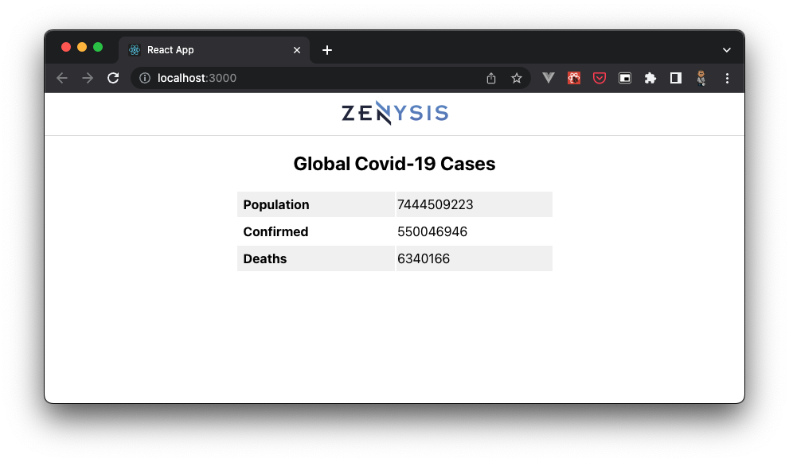

# Overview
Web application for viewing Covid-19 statics. It is built with a Python Flask backend to accomplish 2 primary workflows.

- Sourcing/ingesting data from a public API into a local Postgres database.
- Serving insights through an API to a React JS web client for visualisation.

... More about this on the [wiki](https://github.com/asmbatha/covid-19/wiki)

# Project setup
## Prerequisite
Make sure you have the following installed on your computer.

* Install and start Docker - https://docs.docker.com/get-docker/
* Install Nodejs - https://nodejs.org/en/download/
* Install Python 3.9
* Clone the source code `git clone https://github.com/asmbatha/covid-19.git`

## Run locally

```bash
sh start.sh
```

In your terminal, navigate to the root directory of this repo and simply run `sh start.sh`.  

Be patient as we set up the database, api, and client.
The web app should open automatically on your browser.  

If you don't get any results in you first try, we may have started the application before the database was.  
Firstly, refresh your browser to make sure the race condition hasn't been resolved in the background. If that doesn't work, run `sh start.sh` once more and all should be fixed.🙃


Checkout the [wiki](https://github.com/asmbatha/covid-19/wiki) for more details about this project.
